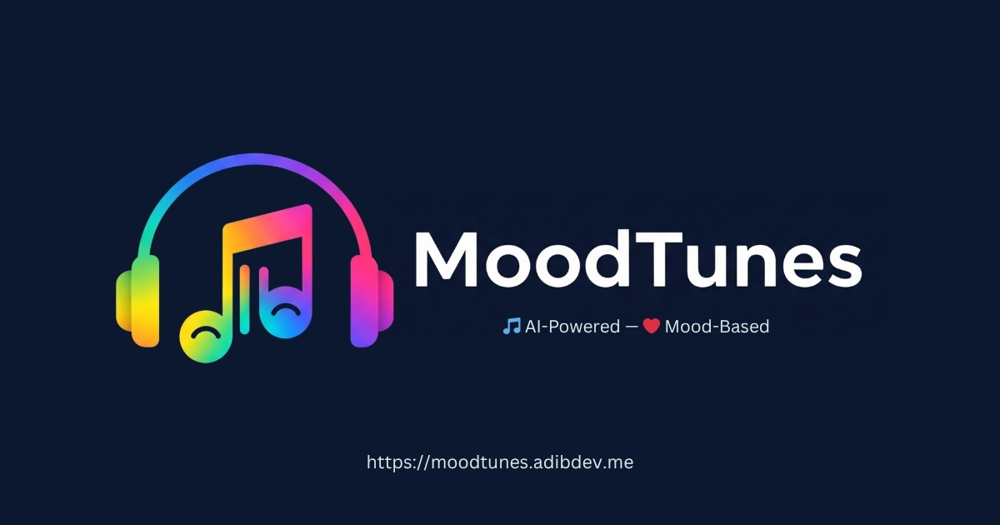
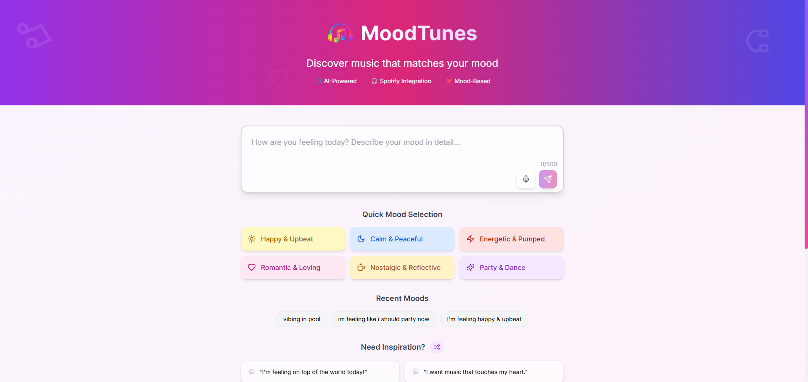
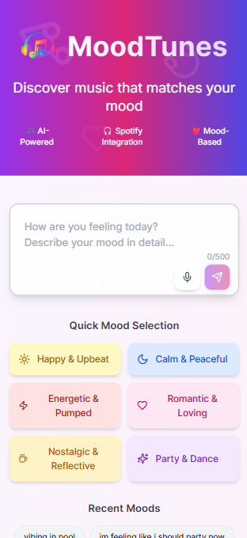

# 🎶 MoodTunes – AI-Powered Mood-Based Music Playlist Generator

MoodTunes is a modern web application that generates personalized Spotify playlists based on your current mood. Powered by advanced AI emotion detection (Hugging Face), a beautiful responsive UI, and real-time Spotify integration, MoodTunes helps you discover the perfect music for every feeling.



---

## 🚀 Features

- **AI Mood Detection:** Enter how you feel (text or voice) and MoodTunes uses Hugging Face AI to understand your mood—even nuanced or mixed emotions.
- **Spotify Integration:** Instantly generates playlists using real Spotify tracks, no local data or static lists.
- **Responsive, Modern UI:** Built with Next.js and Tailwind CSS, fully responsive for mobile and desktop.
- **Voice Input:** Speak your mood using your device’s microphone.
- **Dynamic Mood Suggestions:** Get AI-inspired, ever-changing mood prompt ideas.
- **Playlist Statistics:** View track count, total duration, average popularity, and more.
- **Accessibility & SEO:** Optimized for search engines and accessible for all users.
- **PWA Ready:** Install MoodTunes as an app on your device.

---

## 🛠️ Tech Stack

- **Frontend:** Next.js (App Router, Server Actions), React, Tailwind CSS, Framer Motion
- **Backend:** Node.js (API routes), Hugging Face Inference API, Spotify Web API
- **AI/ML:** Hugging Face emotion classification models
- **Other:** Vercel (deployment), ESLint, Prettier

---

## 📸 Screenshots

| Desktop | Mobile |
| ------- | ------ |
|  |  |

---

## ⚡ Getting Started

1. **Clone the repository:**
   ```
   git clone https://github.com/Adib23704/MoodTunes.git
   cd MoodTunes
   ```

2. **Install dependencies:**
   ```
   npm install
   ```

3. **Create `.env.local` with your credentials:**
   ```
   SPOTIFY_CLIENT_ID=your_spotify_client_id
   SPOTIFY_CLIENT_SECRET=your_spotify_client_secret
   
   HUGGINGFACE_API_KEY=your_huggingface_api_key
   ```

4. **Run the development server:**
   ```
   npm run dev
   ```

5. **Open [http://localhost:3000](http://localhost:3000) to use the app.**

---

## 🎤 How It Works

1. **Describe your mood** (type or use voice).
2. **AI analyzes** your input for nuanced emotions.
3. **MoodTunes fetches** a playlist from Spotify tailored to your mood.

---

## 🧠 Advanced AI Mood Detection

- Uses multiple Hugging Face models for robust emotion and sentiment analysis.
- Supports nuanced and mixed feelings (e.g., "happy but a bit anxious").
- Detects language and uses localized models if needed.
- Visualizes confidence and intensity of detected emotions.

---

## 📦 Deployment

- Ready to deploy on [Vercel](https://vercel.com/) or any Next.js-compatible host.
- Includes PWA manifest and SEO meta tags for best discoverability.

---

## 🙏 Credits

- [Spotify Web API](https://developer.spotify.com/)
- [Hugging Face Inference API](https://huggingface.co/inference-api)
- [Tailwind CSS](https://tailwindcss.com/)
- [Next.js](https://nextjs.org/)
- [Framer Motion](https://www.framer.com/motion/)

---

## 📄 License

[MIT](LICENSE)

---

## 💬 Feedback

Have ideas, suggestions, or want to contribute?  
Open an issue or pull request.

---

> _Built with ❤️ by Adib. Music for every mood!_